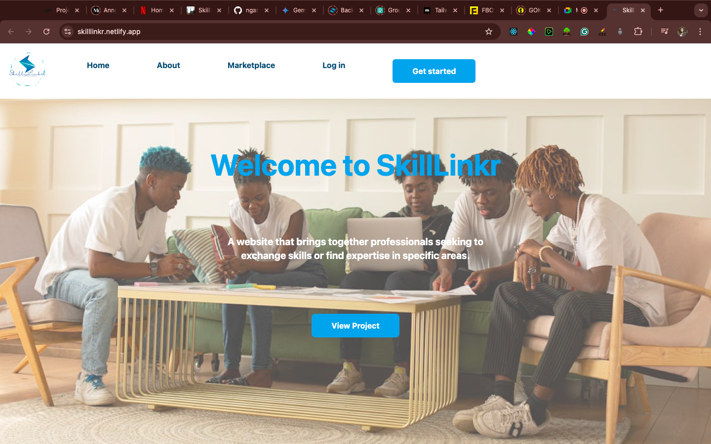

# SkillLinkr

## Introduction

**SkillLinkr** is a modern platform designed to bridge the gap between skills and opportunities, enabling professionals and businesses to connect and grow. Our platform focuses on delivering innovative solutions for professionals seeking to enhance their skills or businesses looking to hire skilled talent.

- **Deployed Site**: [Visit SkillLinkr](https://skilllinkr.netlify.app/)
- **Project Blog Article**: [SkillLinkr Project Blog](https://blog.skilllinkr.com/final-project)
- **Author(s)**: 
  - [Kyenpya Gutap](https://www.linkedin.com/in/johndoe/) 
  - [Kelvin Mukaria](https://www.linkedin.com/in/janesmith/)

## Screenshot

## Installation

To run the project locally, follow these steps:

   ## Installation

To set up the project locally using Vite, follow these steps:
1. **Clone the repository**:
   git clone https://github.com/ngari-kev/skilllinkr.git

2. **Install Vite globally** (if you don't have it installed already):
   npm install -g create-vite
   Create a new Vite project:

3. **npm create vite@latest skilllinkr --template react**
    Navigate to the project directory:

 
4. **cd skilllinkr**
    Install project dependencies:
 
5. **npm install**
    Run the development server:

6. **npm run dev**
    Open your browser and go to http://localhost:5173 to view the app.

## What is this about?

This is a platform that allows users to find professionals gifted and/or skilled in various disciplines. This is necessary for matching so as to share ideas or seek a second opinion on a given subject matter.

---
More to follow as `SkillLinkr` comes to life.

## Usage
Once the project is set up, you can explore the following features:

## Marketplace: Browse a list of professionals and their skills.
- Login and Signup: Register or sign in to create your own profile.
- Profile Management: Customize and manage your personal and professional profile.
- Search for Skills: Use the search functionality to find specific talents.
- Contributing

## We welcome contributions from the community! Here's how you can get involved:

- Fork the repository.
- Create a new branch for your feature or bugfix.
- Commit your changes and open a pull request.
- For detailed contribution guidelines, please refer to our   Contribution Guide.

## Related Projects
- LinkedIn: SkillLinkr's mission and vision share similarities with LinkedIn's professional networking.
- Upwork: A freelance platform connecting skilled individuals with businesses.

## License
This project is licensed under the MIT License. See the LICENSE file for details.

